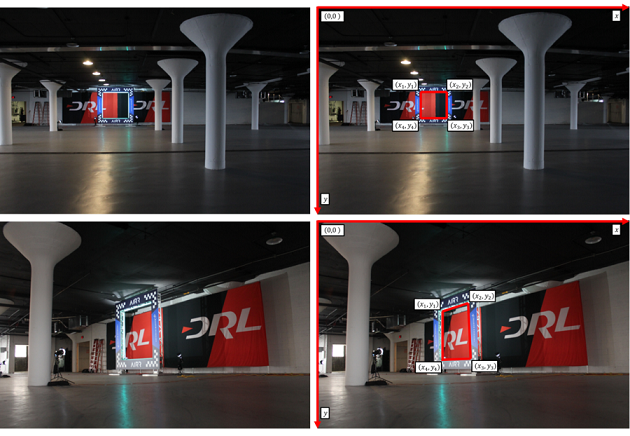
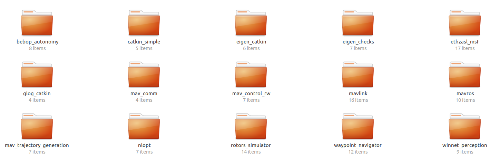

# winnet-perception-AlphaPilot

**The repository containes two parts: a CNN for window corner postion detection of AlphaPilot machine vision test and a ROS perception node "winnet" for the future closed-loop controls.**

### CNN Corner Detector 

The goal is to develp a reliable pipeline to detect the corner postions of the window automatically. The inputs are images shown in the left, and the outputs are the corner (x, y) postions shownn in the right. 

The outputs are eight continuous numbers, thus we consider the task as a regression problem instead of a classification problem. In fact, this corner postion detection task is very similar to the “Facial key-points detection” competition organized by Kaggle during the past several years. Both tasks aim to detect "key points" in the images. Thus, some well known multi-label classifier like YOLO, SSD, and Faster-RCNN aren't selected. A simple regression CNN was developed as the corner detector. 

The CNN is very simple, but achieved 72% pixel accuracy in the AlphaPilot leaderboard.

---

### winnet ROS node 
A ROS node was created for the future perception-action development. The created node was simulated in the [rotors_simulator](https://github.com/ethz-asl/rotors_simulator) on a Bebop drone. 

The packages used for simulations are shown in the following image.

---

### The simulation reust can be viewed by clicking on the GIF below.

